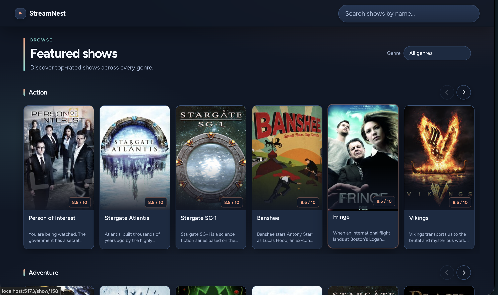

# StreamNest

StreamNest is a TV discovery dashboard built with Vue 3 and TypeScript using the public [TVMaze API](https://www.tvmaze.com/api).

It provides a simple and intuitive way to browse TV shows by genre, search by title, and view detailed show information.

---

## Getting Started

### 1. Requirements

Make sure you have:

* Node.js `20.x` or `22.x`
* npm `10+`

---

### 2. Install dependencies

```bash
npm install
```

---

### 3. Run the app locally

```bash
npm run dev
```

Once started, open:

[http://localhost:5173](http://localhost:5173)

---

### 4. Build for production

```bash
npm run build
npm run preview
```

---

### 5. Run tests

```bash
npm run test:run
```

Run smoke E2E:

```bash
npm run e2e
```

---

## Features

* Browse TV shows grouped by genre (horizontal rails)
* Shows sorted by rating (descending) within each genre
* Genre-based browsing and filtering
* Dedicated genre page (`/genre/:genre`) with load more & back navigation
* Search shows by title using debounced API search
* Detailed show page with poster, rating, genres, and summary
* Loading, empty, and error states across the app
* Responsive design for mobile, tablet, and desktop
* Lazy-loaded images and skeleton loaders for better UX

---

## Tech Stack

* **Vue 3**
* **TypeScript** 
* **Pinia** 
* **Vue Router**
* **Vitest + Vue Test Utils** 
* **SCSS + CSS variables** 
---

## Dashboard Snapshot


